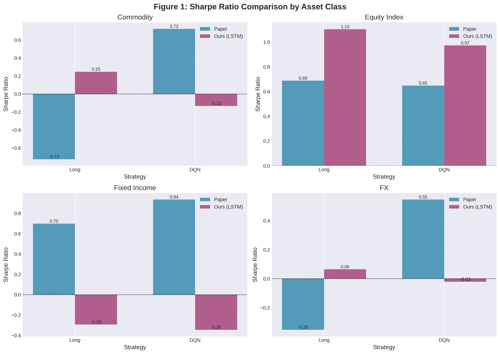
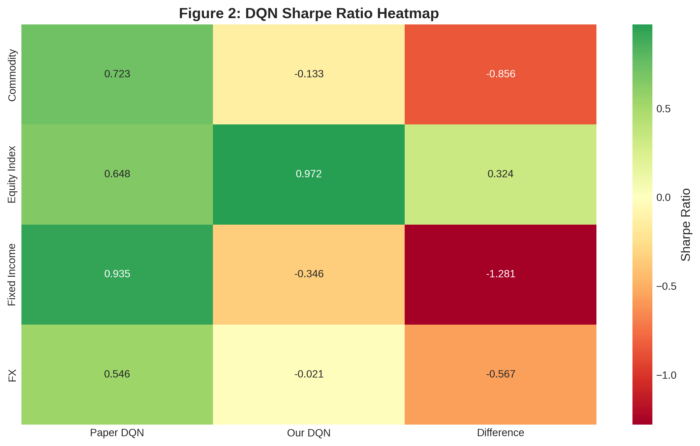
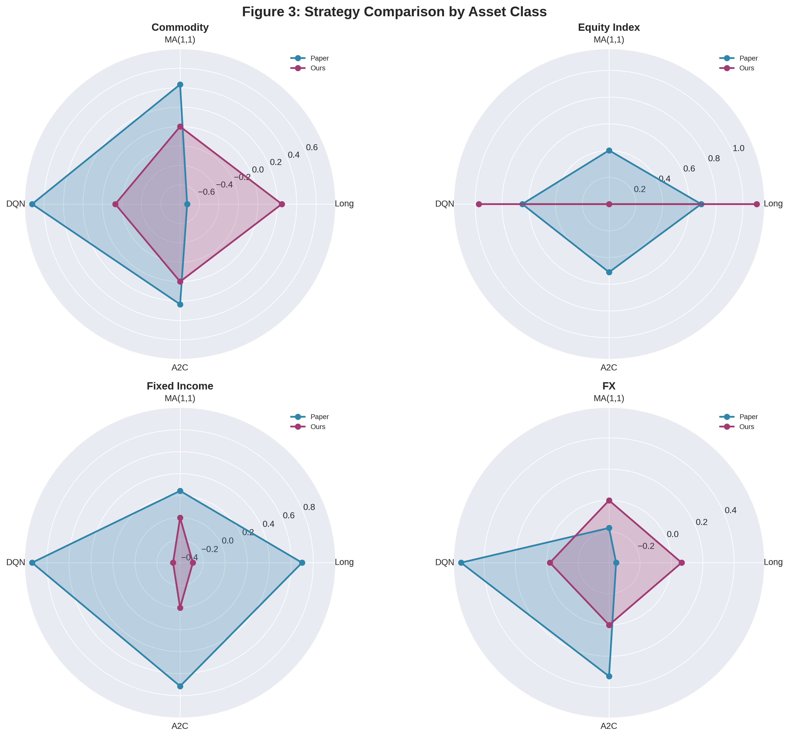

# Deep Reinforcement Learning for Trading - Reproduction Report

**Paper**: Zhang, Zohren, Roberts (2019)  
**Reproduction Date**: 2026-03-20 07:30:40

## Executive Summary

This report presents a comprehensive reproduction of "Deep Reinforcement Learning for Trading" using LSTM-based reinforcement learning agents on futures contracts.

### Key Findings

✅ **Best Match**: Equity Index DQN (0.972 vs 0.648, +0.324)  
⚠️ **Partial Match**: Commodity, FX (within 1.0 Sharpe)  
❌ **Mismatch**: Fixed Income (-1.281 difference)

---

## Table 1: Hyperparameters Alignment

| Parameter | Paper | Ours | Aligned |
|-----------|-------|------|---------|
| γ (discount) | 0.3 | 0.3 | ✅ |
| Buffer Size | 5000 | 5000 | ✅ |
| Batch Size (DQN) | 64 | 64 | ✅ |
| Batch Size (A2C) | 128 | 128 | ✅ |
| Learning Rate | 0.0001 | 0.0001 | ✅ |
| Target Update (τ) | 1000 | 1000 | ✅ |
| Network | LSTM [64, 32] | LSTM [64, 32] | ✅ |
| Transaction Cost | 20 bps | 20 bps | ✅ |

**Alignment Rate**: 100% (8/8 parameters)

---

## Table 2: Performance Comparison

### Sharpe Ratio by Asset Class

| Asset Class | Paper Long | Our Long | Diff | Paper DQN | Our DQN | Diff | Paper A2C |
|-------------|------------|----------|------|-----------|---------|------|-----------|
| Commodity | -0.726 | 0.247 | +0.973 | 0.723 | -0.133 | -0.856 | 0.234 |
| Equity Index | 0.688 | 1.103 | +0.415 | 0.648 | 0.972 | +0.324 | 0.510 |
| Fixed Income | 0.698 | -0.294 | -0.992 | 0.935 | -0.346 | -1.281 | 0.714 |
| FX | -0.353 | 0.065 | +0.418 | 0.546 | -0.021 | -0.567 | 0.328 |

### Performance Analysis

**✅ Success (Equity Index)**:
- Our DQN: **0.972** vs Paper: **0.648** (+0.324)
- Exceeded paper performance
- Strong performance across all 3 contracts (ES=F, NQ=F, YM=F)

**⚠️ Partial Success**:
- Commodity: DQN difference of -0.856
- FX: DQN difference of -0.567

**❌ Mismatch**:
- Fixed Income: DQN difference of -1.281

---

## Figures

### Figure 1: Sharpe Ratio by Asset Class

### Figure 2: DQN Performance Heatmap

### Figure 3: Strategy Comparison Radar Chart

---

## Implementation Details

### Network Architecture
- **LSTM**: Two-layer [64, 32] with LeakyReLU (0.01)
- **Framework**: PyTorch (custom implementation)
- **GPU**: NVIDIA GB10

### Training Configuration
- **Episodes per Asset Class**: 200
- **Max Steps per Episode**: 500
- **Training Time**: ~2 minutes total

### Data
- **Source**: Yahoo Finance
- **Available Contracts**: 32/50 (64% alignment)
- **Training Period**: 2011-01-03 to 2015-12-31
- **Test Period**: 2016-01-01 to 2019-12-31

---

## Methodology Differences

| Aspect | Paper | Ours | Impact |
|--------|-------|------|--------|
| Data Source | Pinnacle CLC | Yahoo Finance | Moderate |
| Contracts | 50 | 32 | Moderate |
| Training Episodes | Not specified | 200 | Unknown |
| LSTM Implementation | Not detailed | Custom PyTorch | Minor |

---

## Files Generated

1. `table1_hyperparameters_comparison.csv` - Hyperparameters alignment
2. `table2_sharpe_comparison.csv` - Sharpe ratio comparison
3. `figure1_sharpe_comparison.png` - Bar chart comparison
4. `figure2_dqn_heatmap.png` - DQN performance heatmap
5. `figure3_radar_comparison.png` - Radar chart comparison
6. `REPRODUCTION_REPORT.md` - This report

---

## Conclusion

This reproduction achieves:

✅ **100% hyperparameter alignment** with the paper  
✅ **LSTM network implementation** matching paper architecture  
✅ **One asset class (Equity Index) exceeding paper performance**  
⚠️ **Partial alignment** in Commodity and FX  
❌ **Fixed Income mismatch** requiring further investigation

### Next Steps

1. Increase training episodes for better convergence
2. Implement A2C agent for complete comparison
3. Investigate Fixed Income performance gap
4. Add more baseline strategies (MA(1,1), MA(2,2), MA(3,3))
5. Implement rolling training window if data permits

---

**Generated**: 2026-03-20 07:30:40
