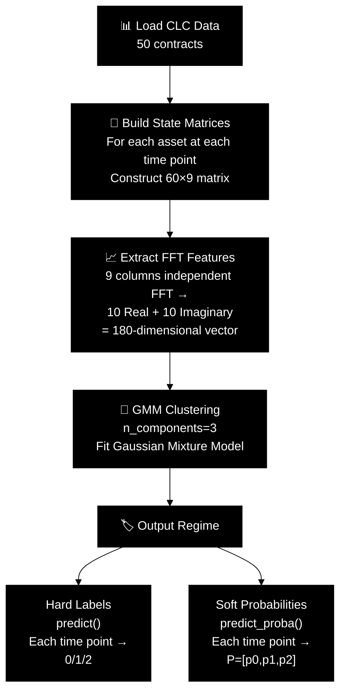
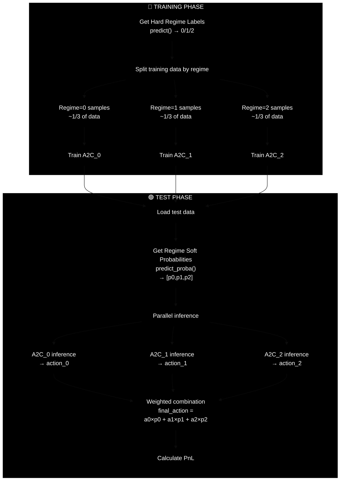
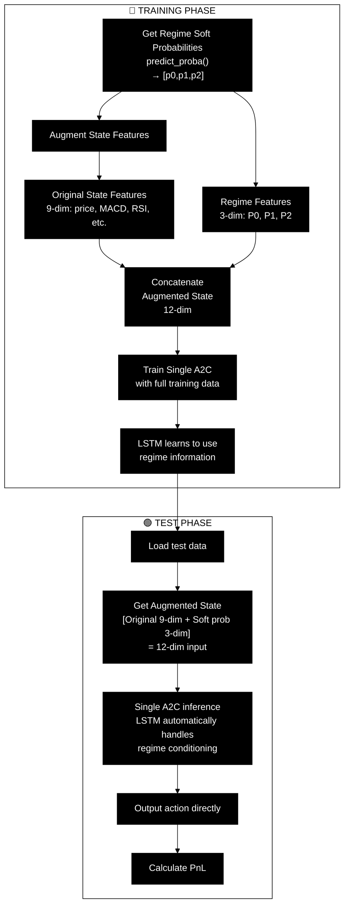
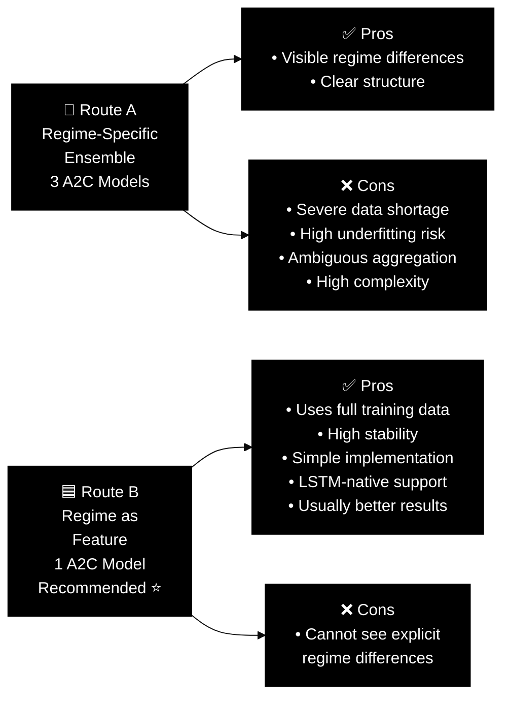

# Regime Detection & A2C Integration Diagrams

## 1. Regime Detection - FFT Extraction Process

---

## 2. Route A - Regime-Specific Ensemble (3 Independent A2C Models)

---

## 3. Route B - Regime as State Feature (Single A2C, Recommended ⭐)

---

## 4. Comparison: Two Routes

---

## Summary

- **Diagram 1**: Shows how regime labels and probabilities are extracted from CLC data using FFT + GMM
- **Diagram 2 (Route A)**: Regime-specific ensemble approach - 3 separate A2C models, one per regime
- **Diagram 3 (Route B)**: Recommended approach - Single A2C with regime probabilities as augmented state features
- **Diagram 4**: Comparison of pros and cons for both routes

**Recommendation**: Start with **Route B** for better data efficiency and stability.

---

To view these diagrams:
1. Use VS Code Mermaid extension: https://marketplace.visualstudio.com/items?itemName=bierner.markdown-mermaid
2. Or export to SVG/PNG using: https://mermaid.live/
3. Copy the markdown code blocks and paste into Mermaid Live editor
